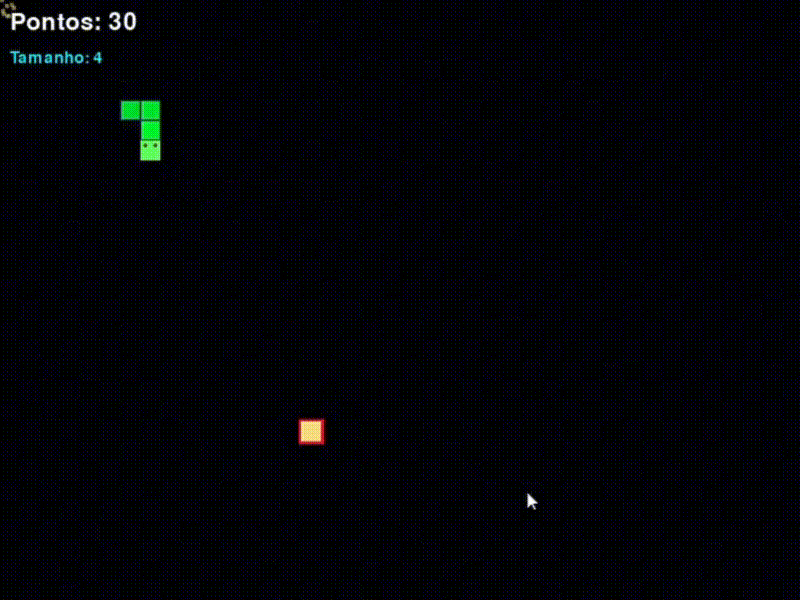

# 🐍 Snake Game Clássico

Bem-vindo ao Snake Game Clássico! Uma releitura moderna do icônico jogo da cobrinha, desenvolvido em Python com a biblioteca Pygame. Desafie seus reflexos, cresça o máximo que puder e divirta-se com efeitos visuais que dão uma nova vida a este clássico.

<p align="center">
  
</p>
---

## ✨ Funcionalidades

Este não é um simples jogo da cobra. Ele foi criado com recursos que modernizam a experiência:

* **Gradiente de Cor Dinâmico:** A cobra exibe um gradiente suave, indo de um verde claro na cabeça para um verde escuro na cauda, facilitando a visualização do seu comprimento.
* **Olhos Expressivos:** A cabeça da cobra possui olhos amarelos que se movem de acordo com a direção, adicionando personalidade ao personagem.
* **Interface Limpa:** Pontuação exibida em tempo real e uma tela de "Game Over" clara e intuitiva.
* **Jogabilidade Clássica:** Mantém a mecânica simples e viciante que todos amam: coma, cresça e não bata!

---

## 🚀 Começando

Para executar o projeto em sua máquina local, siga os passos abaixo.

### Pré-requisitos

* **Python 3.8** ou superior.
* **pip** (gerenciador de pacotes do Python).

### Instalação

1.  **Clone o repositório** (ou simplesmente baixe os arquivos):
    ```bash
    git clone (https://github.com/deboraedithm/snake_game)
    cd seu-repositorio
    ```

2.  **Crie e ative um ambiente virtual** (recomendado):
    ```bash
    # Para Windows
    python -m venv venv
    .\venv\Scripts\activate

    # Para macOS/Linux
    python3 -m venv venv
    source venv/bin/activate
    ```

3.  **Instale as dependências:**
    O jogo utiliza apenas a biblioteca `pygame`. Você pode instalá-la diretamente:
    ```bash
    pip install pygame
    ```

4.  **Execute o jogo:**
    ```bash
    python snake_game.py
    ```
    *(**Nota:** Se você nomeou seu arquivo de forma diferente, altere o comando acima)*

---

## 🎮 Como Jogar

Os controles são simples e diretos:

| Tecla                   | Ação                                    |
| :---------------------- | :-------------------------------------- |
| **↑ Seta para Cima**    | Mover a cobra para cima                 |
| **↓ Seta para Baixo**   | Mover a cobra para baixo                |
| **← Seta para Esquerda**| Mover a cobra para a esquerda           |
| **→ Seta para Direita** | Mover a cobra para a direita            |
| **ENTER**               | Reiniciar o jogo (na tela de Game Over) |

O objetivo é controlar a cobra para comer as "comidas" amarelas que aparecem na tela. Cada comida consumida aumenta o comprimento da cobra e sua pontuação. O jogo termina se a cobra colidir com as paredes ou com o próprio corpo.
